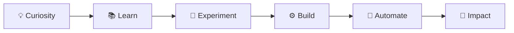

<div align="center">

# 👋 Hi, I'm Muhammad Riyan

### AI & Python Developer · Machine Learning · Deep Learning · Agentic AI

**Turning curiosity into code, data into intelligence, and ideas into intelligent systems.**

<br>

[](https://Muhammad-Riyan1.github.io)
[](https://www.linkedin.com/in/muhammad-riyan-021288338)
[](https://github.com/Muhammad-Riyan1)
[](mailto:mhdriyankhn@gmail.com)

<br>

`MACHINE LEARNING` • `DEEP LEARNING` • `COMPUTER VISION` • `AGENTIC AI` • `DATA ENGINEERING`

</div>

---

<div align="center">

### ✦ From Curiosity to Impact

</div>



---

## 👨‍💻 About Me

I'm a **Computer Science student and AI-focused Python developer** passionate about building intelligent, data-driven systems.

My interests span **Machine Learning, Deep Learning, Computer Vision, NLP, Agentic AI, Data Engineering, Cloud Analytics, and Intelligent Automation**.

I enjoy moving beyond isolated experiments and exploring the complete AI engineering process.


* 🔭 Currently building **Scalable Machine Learning Models & Custom AI Workflows**
* 🤖 Exploring **Agentic AI, LLMs & Intelligent Automation**
* 👁️ Working with **Deep Learning & Computer Vision**
* 📊 Developing skills in **PySpark, Databricks & Cloud Analytics**
* ⚙️ Building automated workflows with **n8n, APIs & Python**
* 🎓 Pursuing **BS Computer Science — UET Peshawar**
* 📫 Reach me at **[mhdriyankhn@gmail.com](mailto:mhdriyankhn@gmail.com)**

---

## 🚀 Featured Work

<table>
<tr>
<td width="50%" valign="top">

### 🩻 Medical Image Classification

Deep-learning image classification pipeline focused on CNN-based model development, training, experimentation, and evaluation.

**Stack**

`Python` `PyTorch` `CNN` `Computer Vision`

**Focus**

Model Training · Image Processing · Evaluation

</td>

<td width="50%" valign="top">

### 🤖 Automated Tabular Data Agent

Intelligent workflow designed to retrieve structured data, process it, and automatically generate analytical outputs.

**Stack**

`n8n` `Agentic AI` `APIs` `Data Analysis`

**Focus**

AI Workflows · Automation · Data Processing

</td>
</tr>

<tr>
<td width="50%" valign="top">

### ☁️ E-Commerce Analytics Engine

Cloud-oriented analytics workflow for processing, transforming, and analyzing e-commerce datasets.

**Stack**

`PySpark` `Databricks` `AWS` `Python`

**Focus**

ETL · Distributed Processing · Cloud Analytics

</td>

<td width="50%" valign="top">

### 📦 Product Data Extraction

Automated workflow for extracting product information and transforming it into structured datasets.

**Stack**

`Python` `Automation` `Data Extraction`

**Focus**

Extraction · Processing · Structured Data

</td>
</tr>
</table>

---

## 🧠 Technical Focus

<table>
<tr>

<td width="33%" valign="top">

### 🧠 AI / ML

`Machine Learning`

`Deep Learning`

`Computer Vision`

`NLP`

`LLMs`

`Model Fine-Tuning`

</td>

<td width="33%" valign="top">

### 📊 Data / Cloud

`PySpark`

`Databricks`

`AWS`

`Pandas`

`NumPy`

`MySQL`

</td>

<td width="33%" valign="top">

### ⚡ Automation

`Agentic AI`

`n8n`

`API Automation`

`Supabase`

`Python`

`AI Workflows`

</td>

</tr>
</table>

---

## 🛠️ Technologies

<div align="center">

### Languages & AI


### Data


### Cloud & Automation


### Development


</div>

---

## ⚡ Currently

```python
muhammad_riyan = {
    "role": "AI & Python Developer",

    "education": "BS Computer
```
