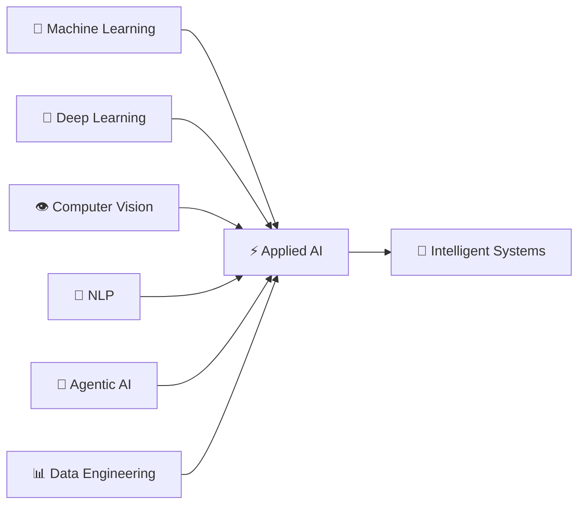
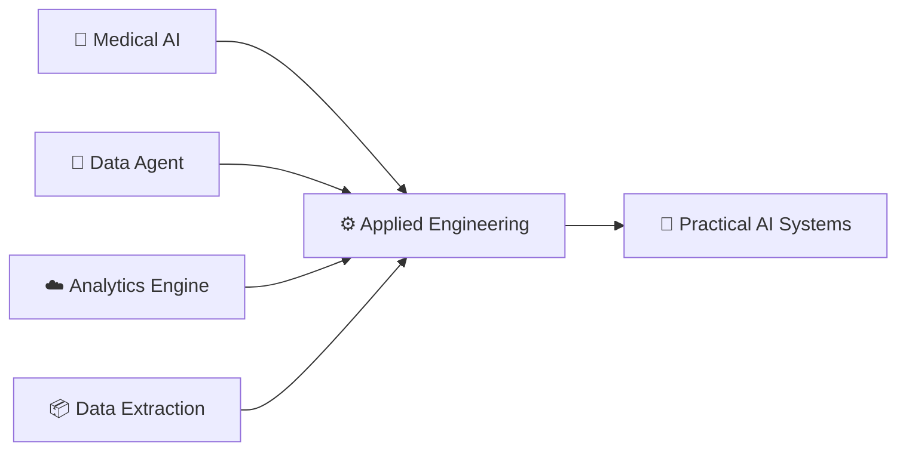
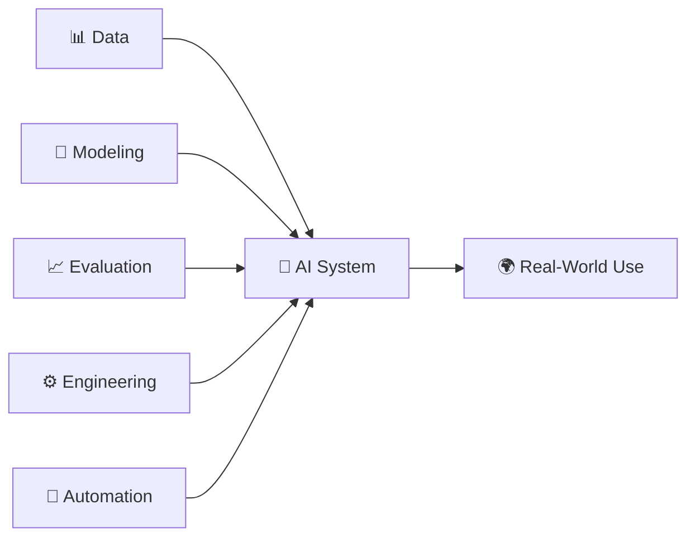
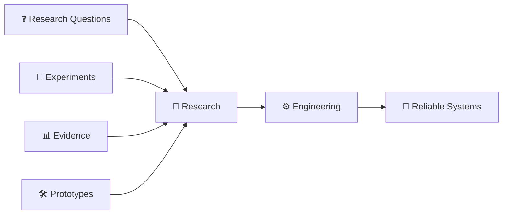
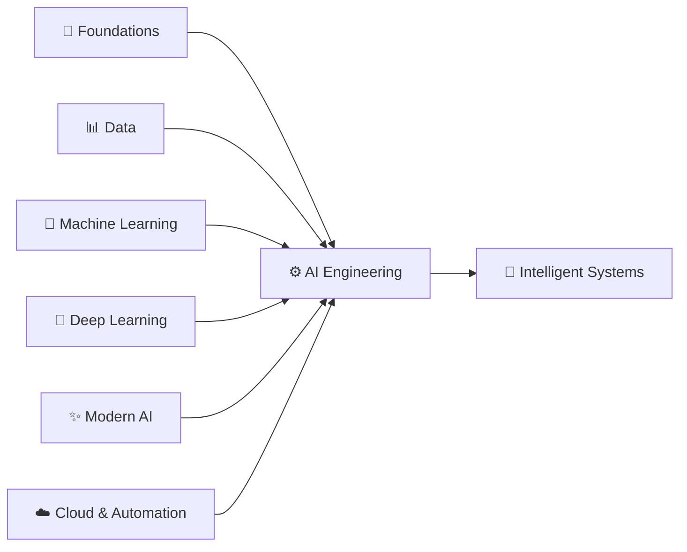
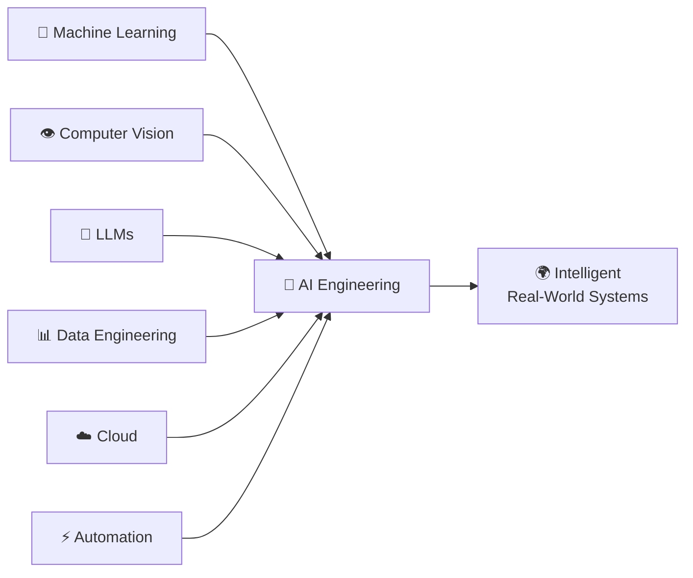
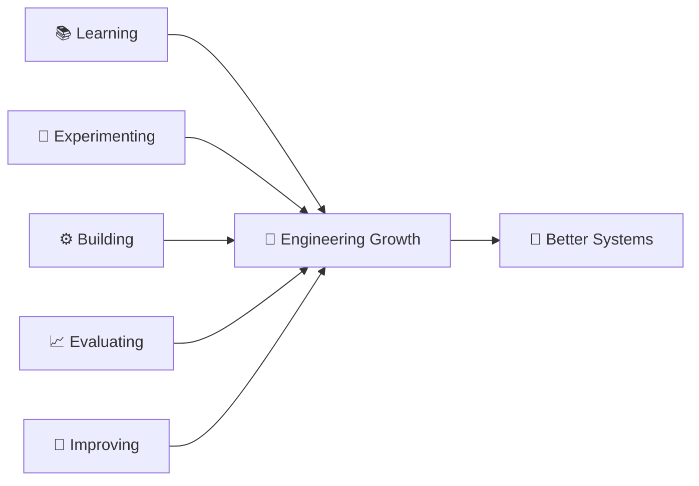
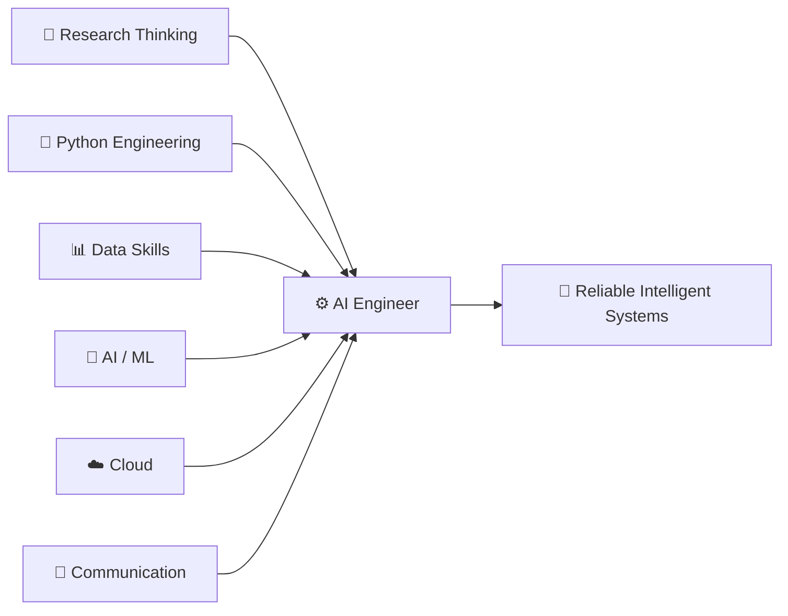

<div align="center">

# 👋 Hi, I'm Muhammad Riyan

### AI & Python Developer · Machine Learning · Deep Learning · Agentic AI

**Building intelligent systems by connecting data, models, engineering, and automation.**

<br>

[](https://Muhammad-Riyan1.github.io)
[](https://www.linkedin.com/in/muhammad-riyan-021288338)
[](https://github.com/Muhammad-Riyan1)
[](mailto:mhdriyankhn@gmail.com)

<br>

`MACHINE LEARNING` · `DEEP LEARNING` · `COMPUTER VISION` · `AGENTIC AI` · `DATA ENGINEERING`

</div>

---

## 👨‍💻 About Me

I'm a **Computer Science student and AI-focused Python developer** passionate about building intelligent, data-driven systems.

My interests span **Machine Learning, Deep Learning, Computer Vision, NLP, Agentic AI, Data Engineering, Cloud Analytics, and Intelligent Automation**.

I'm particularly interested in what happens **after a model is trained** — how data, models, APIs, automation, and software engineering can work together to create useful systems.

* 🔭 Currently building **Scalable Machine Learning Models & Custom AI Workflows**
* 🤖 Exploring **Agentic AI, LLMs & Intelligent Automation**
* 👁️ Working with **Deep Learning & Computer Vision**
* 📊 Developing skills in **PySpark, Databricks & Cloud Analytics**
* ⚙️ Building automated workflows with **n8n, APIs & Python**
* 🎓 Pursuing **BS Computer Science — UET Peshawar**
* 📫 Reach me at **[mhdriyankhn@gmail.com](mailto:mhdriyankhn@gmail.com)**

---

## 🧠 My AI Engineering Map



---

## 🚀 Featured Work

<table>
<tr>
<td width="50%" valign="top">

### 🩻 Medical Image Classification

Deep-learning image classification pipeline focused on CNN-based model development, training, experimentation, and evaluation.

**Stack**

`Python` `PyTorch` `CNN` `Computer Vision`

**Focus**

Model Training · Image Processing · Evaluation

</td>

<td width="50%" valign="top">

### 🤖 Automated Tabular Data Agent

Intelligent workflow designed to retrieve structured data, process it, and automatically generate analytical outputs.

**Stack**

`n8n` `Agentic AI` `APIs` `Data Analysis`

**Focus**

AI Workflows · Automation · Data Processing

</td>
</tr>

<tr>
<td width="50%" valign="top">

### ☁️ E-Commerce Analytics Engine

Cloud-oriented analytics workflow for processing, transforming, and analyzing e-commerce datasets.

**Stack**

`PySpark` `Databricks` `AWS` `Python`

**Focus**

ETL · Distributed Processing · Cloud Analytics

</td>

<td width="50%" valign="top">

### 📦 Product Data Extraction

Automated workflow for extracting product information and transforming it into structured datasets.

**Stack**

`Python` `Automation` `Data Extraction`

**Focus**

Extraction · Processing · Structured Data

</td>
</tr>
</table>

---

## 🔗 How My Projects Connect

Each project strengthens a different part of the engineering stack while contributing toward the same goal: building useful intelligent systems.



---

## 🛠️ Technical Stack

<div align="center">

### 🧠 AI & Machine Learning


### 📊 Data & Cloud


### ⚡ Engineering & Automation


</div>

---

## ⚡ Currently

```python id="current01"
muhammad_riyan = {
    "role": "AI & Python Developer",

    "education": "BS Computer Science @ UET Peshawar",

    "building": [
        "Scalable Machine Learning Models",
        "Custom AI Workflows",
        "Data-Driven Intelligent Systems",
    ],

    "exploring": [
        "Agentic AI",
        "Large Language Models",
        "Computer Vision",
        "Cloud Data Engineering",
    ],

    "goal": "Turn AI concepts into useful real-world systems.",

    "status": "Learning. Building. Improving. 🚀"
}
```

---

## ⚙️ My AI Engineering Workflow

My focus extends beyond training models toward understanding how the major parts of an AI system work together.



For me, AI development isn't finished when a model reaches an acceptable metric.

A complete system should consider **data quality, model performance, engineering, integration, automation, and real-world usefulness**.

---

## 🔬 Research → Production

I'm interested in strengthening the connection between **AI experimentation and practical engineering**.



> **Research asks:** What works, and why?

> **Engineering asks:** How can we make it useful, reliable, and repeatable?

I'm working toward becoming stronger at both.

---

## 🧭 Technical Growth Path

This represents the technical areas I'm developing and how they contribute toward my broader engineering direction.



<div align="center">

### The goal isn't to collect technologies.

### The goal is to become better at solving difficult problems.

</div>

---

## 💡 Engineering Principles

<table>
<tr>
<td width="50%" valign="top">

### 01 · Fundamentals First

Frameworks change. Strong fundamentals make it easier to understand and adapt to new technologies.

</td>

<td width="50%" valign="top">

### 02 · Build to Learn

Theory gives direction. Building reveals the gaps in understanding.

</td>
</tr>

<tr>
<td width="50%" valign="top">

### 03 · Evaluate With Evidence

Experiments and models should be judged by meaningful evaluation rather than assumptions.

</td>

<td width="50%" valign="top">

### 04 · Engineer for Clarity

Useful systems should remain understandable, maintainable, and reproducible.

</td>
</tr>

<tr>
<td width="50%" valign="top">

### 05 · Automate With Purpose

Automation should reduce unnecessary work and make systems more useful.

</td>

<td width="50%" valign="top">

### 06 · Document the Work

A strong project communicates its problem, architecture, decisions, results, and limitations.

</td>
</tr>
</table>

---

## 🎯 What I'm Building Toward

My interests aren't isolated technologies. They converge toward one broader goal.



---

## 🚀 Areas I Want to Explore Further

<table>
<tr>
<td width="50%" valign="top">

### 🤖 Agentic AI

Building systems where models can interact with:

`Tools` · `APIs` · `Data` · `Workflows`

</td>

<td width="50%" valign="top">

### 👁️ Computer Vision

Developing stronger experience with:

`CNNs` · `Image Classification` · `Deep Learning` · `Evaluation`

</td>
</tr>

<tr>
<td width="50%" valign="top">

### 📊 Data Engineering

Building scalable workflows with:

`Python` · `PySpark` · `Databricks` · `Cloud`

</td>

<td width="50%" valign="top">

### ⚡ Intelligent Automation

Connecting:

`Models` · `n8n` · `APIs` · `Databases` · `Services`

</td>
</tr>
</table>

---

## 🎯 Current Goals

### `01` · Strengthen AI Fundamentals

Go deeper into **Machine Learning, Deep Learning, Computer Vision, and NLP**.

### `02` · Build End-to-End Projects

Move beyond isolated notebooks toward complete, documented engineering projects.

### `03` · Explore Agentic Systems

Learn how models can interact with **tools, APIs, data, and external services**.

### `04` · Improve Data Engineering Skills

Strengthen my understanding of **PySpark, Databricks, cloud analytics, and scalable pipelines**.

### `05` · Contribute to Open Source

Learn from production-quality projects and collaborate with other developers.

---

## 🌱 My Development Approach

Learning, experimentation, implementation, evaluation, and improvement all contribute to the same thing: becoming a stronger engineer.



---

## 🏗️ The Engineer I'm Working to Become

I'm not trying to simply collect technologies.

I'm working toward becoming an engineer who can:

* 🧠 Understand technical problems deeply
* 📊 Work confidently with data
* 🧪 Design meaningful experiments
* 📈 Evaluate results objectively
* 🐍 Write clean Python
* ⚙️ Engineer maintainable systems
* 🔌 Integrate models with APIs and applications
* 🤖 Automate useful workflows
* ☁️ Work with scalable data systems
* 📝 Communicate technical decisions clearly
* 🔁 Learn from failure and iterate

### My Engineering Direction



---

## 🤝 Open to Collaboration

<div align="center">

### Interested in building or discussing something around:

`Artificial Intelligence` · `Machine Learning` · `Computer Vision`

`Agentic AI` · `Python` · `Data Engineering` · `Automation`

<br>

### Currently Open To

🎓 **AI / ML Internships**

🔬 **Research Collaborations**

💻 **Open-Source Contributions**

🤖 **AI & Machine Learning Projects**

⚡ **Agentic AI / Automation**

📊 **Data Engineering Projects**

<br>

## Let's build something meaningful.

<br>

[](https://www.linkedin.com/in/muhammad-riyan-021288338)

[](mailto:mhdriyankhn@gmail.com)

</div>

---

<div align="center">

## ✦ Keep Learning. Keep Building.

> ### *“The goal isn't to know everything.*
>
> ### *The goal is to become better at figuring things out.”*

<br>

### `Learn → Experiment → Engineer → Improve`

<br>

## Muhammad Riyan

### AI & Python Developer

`Machine Learning` · `Deep Learning` · `Computer Vision`

`Agentic AI` · `Data Engineering` · `Automation`

<br>

**Building today. Learning for tomorrow. 🚀**

</div>
