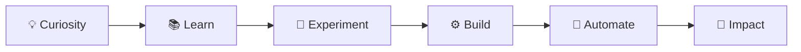
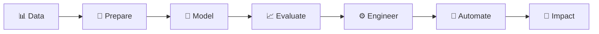
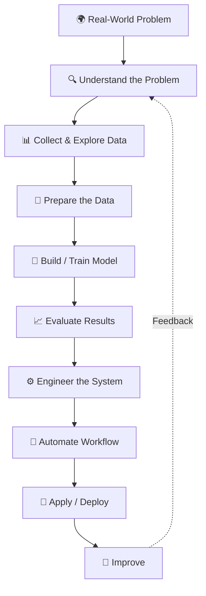
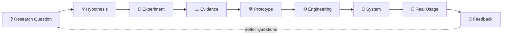
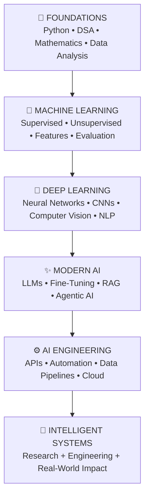
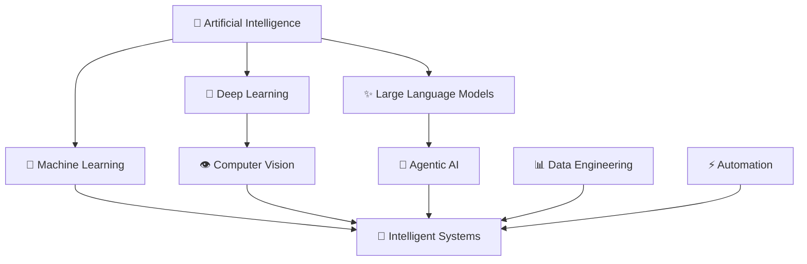
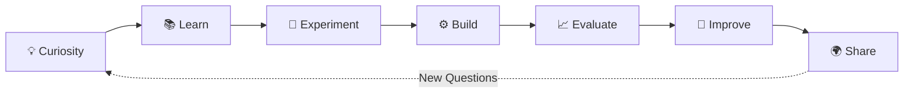
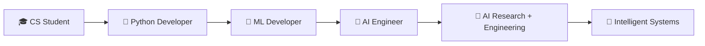
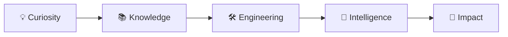

<div align="center">

# 👋 Hi, I'm Muhammad Riyan

### AI & Python Developer · Machine Learning · Deep Learning · Agentic AI

**Turning curiosity into code, data into intelligence, and ideas into intelligent systems.**

<br>

[](https://Muhammad-Riyan1.github.io)
[](https://www.linkedin.com/in/muhammad-riyan-021288338)
[](https://github.com/Muhammad-Riyan1)
[](mailto:mhdriyankhn@gmail.com)

<br>

`MACHINE LEARNING` • `DEEP LEARNING` • `COMPUTER VISION` • `AGENTIC AI` • `DATA ENGINEERING`

</div>

---

<div align="center">

### ✦ From Curiosity to Impact

</div>



---

## 👨‍💻 About Me

I'm a **Computer Science student and AI-focused Python developer** passionate about building intelligent, data-driven systems.

My interests span **Machine Learning, Deep Learning, Computer Vision, NLP, Agentic AI, Data Engineering, Cloud Analytics, and Intelligent Automation**.

I enjoy moving beyond isolated experiments and exploring the complete AI engineering process.



* 🔭 Currently building **Scalable Machine Learning Models & Custom AI Workflows**
* 🤖 Exploring **Agentic AI, LLMs & Intelligent Automation**
* 👁️ Working with **Deep Learning & Computer Vision**
* 📊 Developing skills in **PySpark, Databricks & Cloud Analytics**
* ⚙️ Building automated workflows with **n8n, APIs & Python**
* 🎓 Pursuing **BS Computer Science — UET Peshawar**
* 📫 Reach me at **[mhdriyankhn@gmail.com](mailto:mhdriyankhn@gmail.com)**

---

## 🚀 Featured Work

<table>
<tr>
<td width="50%" valign="top">

### 🩻 Medical Image Classification

Deep-learning image classification pipeline focused on CNN-based model development, training, experimentation, and evaluation.

**Stack**

`Python` `PyTorch` `CNN` `Computer Vision`

**Focus**

Model Training · Image Processing · Evaluation

</td>

<td width="50%" valign="top">

### 🤖 Automated Tabular Data Agent

Intelligent workflow designed to retrieve structured data, process it, and automatically generate analytical outputs.

**Stack**

`n8n` `Agentic AI` `APIs` `Data Analysis`

**Focus**

AI Workflows · Automation · Data Processing

</td>
</tr>

<tr>
<td width="50%" valign="top">

### ☁️ E-Commerce Analytics Engine

Cloud-oriented analytics workflow for processing, transforming, and analyzing e-commerce datasets.

**Stack**

`PySpark` `Databricks` `AWS` `Python`

**Focus**

ETL · Distributed Processing · Cloud Analytics

</td>

<td width="50%" valign="top">

### 📦 Product Data Extraction

Automated workflow for extracting product information and transforming it into structured datasets.

**Stack**

`Python` `Automation` `Data Extraction`

**Focus**

Extraction · Processing · Structured Data

</td>
</tr>
</table>

---

## 🧠 Technical Focus

<table>
<tr>

<td width="33%" valign="top">

### 🧠 AI / ML

`Machine Learning`

`Deep Learning`

`Computer Vision`

`NLP`

`LLMs`

`Model Fine-Tuning`

</td>

<td width="33%" valign="top">

### 📊 Data / Cloud

`PySpark`

`Databricks`

`AWS`

`Pandas`

`NumPy`

`MySQL`

</td>

<td width="33%" valign="top">

### ⚡ Automation

`Agentic AI`

`n8n`

`API Automation`

`Supabase`

`Python`

`AI Workflows`

</td>

</tr>
</table>

---

## 🛠️ Technologies

<div align="center">

### Languages & AI


### Data


### Cloud & Automation


### Development


</div>

---

## ⚡ Currently

```python
muhammad_riyan = {
    "role": "AI & Python Developer",

    "education": "BS Computer Science @ UET Peshawar",

    "building": [
        "Scalable Machine Learning Models",
        "Custom AI Workflows",
        "Data-Driven Intelligent Systems",
    ],

    "exploring": [
        "Agentic AI",
        "Large Language Models",
        "Computer Vision",
        "Cloud Data Engineering",
    ],

    "goal": "Turn AI concepts into useful real-world systems.",

    "status": "Learning. Building. Improving. 🚀"
}
```

---

## 🧩 From Problem to Intelligent System

I'm interested in the **complete AI lifecycle**, not only model training.



For me, the question isn't only:

> **“Can I train this model?”**

It's also:

> **“Can I turn it into a useful, understandable, and reliable system?”**

---

## 🔬 Research → Engineering

One of the areas that interests me most is the bridge between **AI experimentation and practical engineering**.



**Research asks:** *What might work?*

**Engineering asks:** *How can we make it useful and reliable?*

I'm working toward becoming stronger at both.

---

## 🧭 Learning Roadmap



<div align="center">

### The goal isn't to collect technologies.

### The goal is to become better at solving difficult problems.

</div>

---

## 💡 Engineering Principles

<table>
<tr>

<td width="50%" valign="top">

### 01 — Fundamentals First

Frameworks change. Strong fundamentals continue to matter.

</td>

<td width="50%" valign="top">

### 02 — Build to Learn

Reading teaches concepts. Building reveals what I still need to understand.

</td>

</tr>

<tr>

<td width="50%" valign="top">

### 03 — Measure, Don't Assume

Models and systems should be evaluated using evidence.

</td>

<td width="50%" valign="top">

### 04 — Keep It Understandable

Good engineering should remain readable, maintainable, and explainable.

</td>

</tr>

<tr>

<td width="50%" valign="top">

### 05 — Automate With Purpose

Automation should remove unnecessary work rather than introduce unnecessary complexity.

</td>

<td width="50%" valign="top">

### 06 — Document the Journey

A strong project explains the problem, approach, decisions, results, and limitations.

</td>

</tr>
</table>

---

<div align="center">

## ✦ Where My Interests Connect

</div>



---

## 🚀 What I Want to Build More Of

<table>
<tr>

<td width="50%" valign="top">

### 🤖 Agentic AI Systems

Intelligent workflows combining:

`LLMs` · `Tools` · `APIs` · `Data` · `Automation`

</td>

<td width="50%" valign="top">

### 👁️ Computer Vision

Applied systems involving:

`Image Classification` · `CNNs` · `Deep Learning` · `Evaluation`

</td>

</tr>

<tr>

<td width="50%" valign="top">

### 📊 Intelligent Data Systems

Scalable pipelines using:

`Python` · `PySpark` · `Databricks` · `Analytics`

</td>

<td width="50%" valign="top">

### ⚡ AI Automation

Connecting:

`AI Models` · `n8n` · `APIs` · `Databases` · `Services`

</td>

</tr>
</table>

---

## 🎯 Current Goals

### `01 — Strengthen AI Fundamentals`

Go deeper into machine learning, deep learning, computer vision, and NLP.

### `02 — Build Better Projects`

Develop well-documented projects that demonstrate complete AI engineering workflows.

### `03 — Explore Agentic Systems`

Build intelligent workflows connecting models, APIs, tools, and data.

### `04 — Contribute to Open Source`

Learn from production-quality projects and collaborate with other developers.

### `05 — Grow as an AI Engineer`

Strengthen both the research and engineering skills required to build reliable intelligent systems.

---

## 🏗️ The Engineer I'm Working to Become

I don't want to simply know a long list of technologies.

I want to become an engineer who can:

* 🧠 Understand difficult technical problems
* 📊 Work carefully with data
* 🔬 Design meaningful experiments
* 📈 Evaluate results objectively
* 🐍 Write clean Python
* ⚙️ Build maintainable systems
* 🤖 Connect AI models with real applications
* ☁️ Understand scalable data and cloud workflows
* 📝 Communicate technical decisions clearly
* 🔁 Keep improving when the first solution doesn't work

---

## 🌱 My Development Loop



<div align="center">

### `Learn → Experiment → Build → Evaluate → Improve`

</div>

---

<div align="center">

## 🚀 Building Toward

</div>



---

## 🤝 Open to Collaboration

<div align="center">

I'm interested in connecting around:

`Artificial Intelligence` • `Machine Learning` • `Computer Vision`

`Agentic AI` • `Python` • `Data Engineering` • `Automation`

<br>

### Currently Open To

**🎓 AI / ML Internships**

**🔬 Research Collaborations**

**💻 Open-Source Contributions**

**🤖 AI & Machine Learning Projects**

**⚡ Agentic AI / Automation Projects**

**📊 Data Engineering Projects**

<br>

### Have an interesting idea or problem?

## Let's build something meaningful.

<br>

[](https://www.linkedin.com/in/muhammad-riyan-021288338)

[](mailto:mhdriyankhn@gmail.com)

</div>

---

<div align="center">

## ✦ Keep Learning. Keep Building.

</div>



<div align="center">

> ### *“The goal isn't to know everything.*
>
> ### *The goal is to become better at figuring things out.”*

<br>

### `Curiosity → Knowledge → Engineering → Impact`

<br>

## Muhammad Riyan

### AI & Python Developer

`Machine Learning` • `Deep Learning` • `Computer Vision`

`Agentic AI` • `Data Engineering` • `Automation`

<br>

### Building today. Learning for tomorrow. 🚀

</div>
